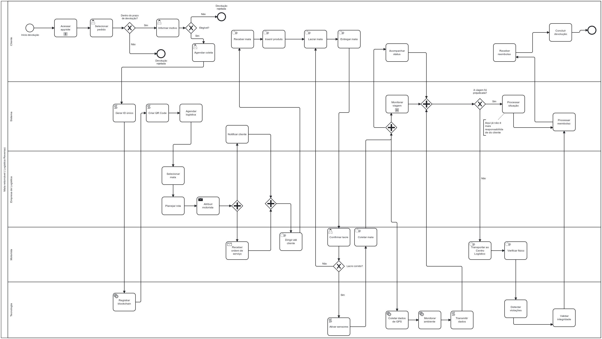
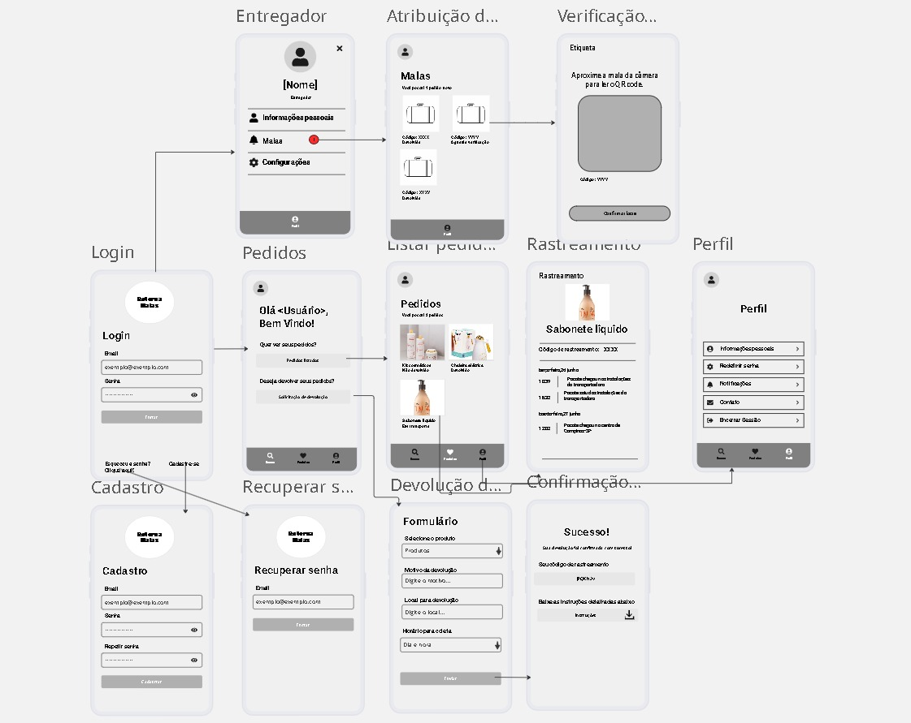

#  Gerência de Processos de Negócios
Repositório para a entrega das atividades realizadas pelo grupo.  
Integrantes: Kaio Henrique da Silva Nezio, Luma Tavares Lopes de Souza, Pedro Renã da Silva Moreira, Remerson Victor Silva da Assurreição, Sofia Nascimento da Silva, Vivian Moreira Gomes de Lacerda.  
Para o acesso das imagens em alta qualidade, acesse o diretório no repositório "acesso_imagens" onde contem o arquivo do modelo BPMN feito e o link onde foi montado a interface gráfica utilizando o site miro.  
O relatório construido pelo grupo está no diretório "relatório" disponível no repositório.

## Modelo BPMN

 
  

  

## Interface Gráfica

 
  

  
